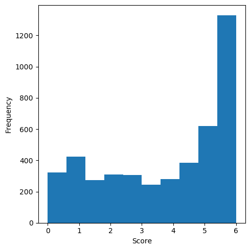
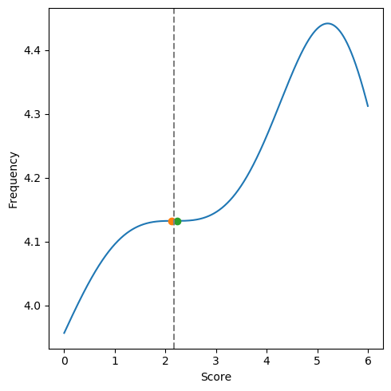
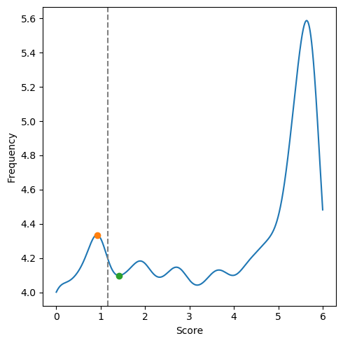
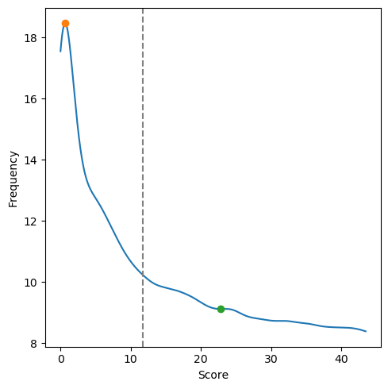
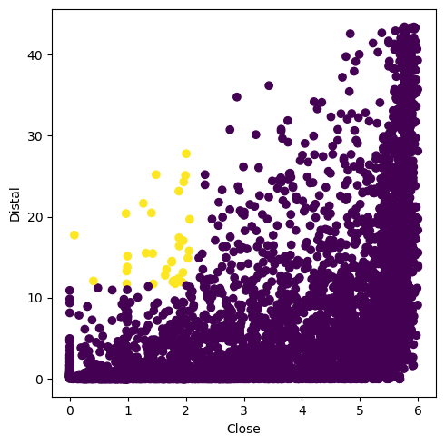
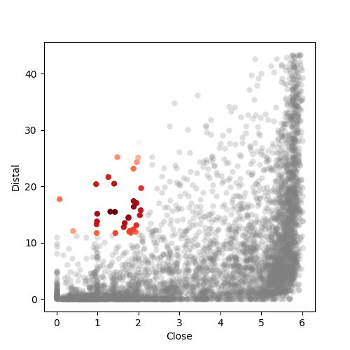

Second run
==========

Now let's go through a bit more sophisticated sample, with more practical program settings and more detailed explanations of analytical procedures.


## Aligner

HGTector should ideally work with a local database and a local program for sequence homology search. This is to ensure fast, controllable and repeatable bioinformatic analyses.

Two protein sequence aligners are supported: **DIAMOND** and **BLAST** . By default, HGTector first looks for `diamond`, then `blastp`, in the current environment. If you need, here is a one-line installation [instruction](install.md#Aligner).


## Database

A reference protein sequence database should ideally contain a significant breadth of known microbial diversity. HGTector provides an automated workflow, `database`, for downloading non-redundant protein sequences from the NCBI server and compiling them into a DIAMOND or BLASTp database.

If you are already convinced that you will invest a dozen hours of computer time and several dozens of GB disk space to build the default database, please read [database](database.md).

Otherwise, let's now make a very small test database to for this quick demo. This database will only contain protein sequences extracted from NCBI-defined microbial "reference genomes".

```
hgtector database -c microbe -t 2 -s 1 -r superkingdom --reference --compile diamond -o <output_dir>
```

There will be around 120 genomes in this catalog. The multi-Fasta file of protein sequences is around 150 MB. If you have any trouble getting this database built automatically, we provide a sample database, **ref107**, for [download](https://www.dropbox.com/s/46v3uc708rvc5rc/ref107.tar.xz?dl=0).

Note that however, with this small database, one really can't expect very high sensitivity in HGT prediction. We will address this later in the tutorial.


## Input data

The input data for HGTector should be one or more multi-Fasta files, each of which represents the complete protein set of a genome, or a bin from a metagenome assembly, or any collection that you consider as an independent evolutionary unit.

Here we will analyze a single genome of [_Escherichia coli_ O55:H7](https://www.ncbi.nlm.nih.gov/assembly/GCF_000025165.1/). It is chosen because the small database of NCBI reference bacterial genomes contains several _E. coli_ strains (O55:H7 is not among them), plus a decent number of gammaproteobacterial genomes, which constitute fair sampling depth of the vertical evolutionary history of _E. coli_.

Download the whole protein set of _E. coli_ O55:H7 (5,278 protein sequences in total) from the NCBI server:

```bash
wget -O o55h7.faa.gz ftp://ftp.ncbi.nlm.nih.gov/genomes/all/GCF/000/025/165/GCF_000025165.1_ASM2516v1/GCF_000025165.1_ASM2516v1_protein.faa.gz
```

You don't need to unzip the file, as HGTector can automatically parse compressed files in the format of gzip, bzip2 and lzma.

## Search

Perform batch **homology search** of the 5,278 protein sequences against the ref107 database.

```bash
hgtector search -i o55h7.faa.gz -o . -m diamond -d <ref107>/diamond/db -t <ref107>/taxdump
```

If you have already entered the database paths in the [configuration](config.md) file, this command can be simplified into:

```bash
hgtector search -i o55h7.faa.gz -o .
```

DIAMOND is fast, and you should expect the output in a few minutes.

For both BLAST and DIAMOND, the output hit table format is:

```
qaccver saccver pident evalue bitscore qcovhsp staxids
```

Three common alignment metrics are present: _E-value_, _% identity_, and _% coverage of query_. You can specify thresholds for them, as well as multiple other metrics, in the search command. For example:

```bash
hgtector search -i o55h7.faa.gz -o . --maxseqs 200 --evalue 1e-20 --identity 50 --coverage 50
```

Plus two columns that are relevant to the subsequent analysis: [bit score](https://www.ncbi.nlm.nih.gov/BLAST/tutorial/Altschul-1.html#head3), and subject TaxID(s).

Meanwhile, HGTector performs **self-alignment** for each input protein sequence to get a bit score, and appends it to the comment lines above each hit table. This score will serve as the baseline for hit score normalization.

Collectively, each hit table in the output file `o55h7.tsv` reads as follow:

```
# ID: WP_000064228.1
# Length: 714
# Product: methylmalonyl-CoA mutase
# Score: 1396.3
# Hits: 33
NP_311814.1	99.7	0.0e+00	1392.1	100.0	386585
YP_002409252.1	99.4	0.0e+00	1391.7	100.0	585057
YP_002413943.1	99.4	0.0e+00	1391.3	100.0	585056
NP_708678.2	99.4	0.0e+00	1390.2	100.0	198214
YP_001006157.1	86.3	0.0e+00	1221.8	100.0	393305
...
```

More details of the `search` command are documented [here](search.md).


## Analyze

With the search results you can proceed to predict HGTs using the `analyze` command. Let's first try the default setting:

```bash
hgtector analyze -i o55h7.tsv -o . -t <ref107>/taxdump
```

We will go through the individual procedures behind this command, and explain what they mean and how you can further optimize them.


### Multiple samples

This demo only involves one sample (_E. coli_ O55:H7), but you may also provide multiple samples for a combined analysis. This is different from the `search` command which can also take multiple samples but each of which is searched _independently_. In this analysis, the multiple samples are considered evolutionarily related and their member genes are treated _as a whole_. The analysis will help to differentiate HGT patterns among those samples. For example, you may provide multiple _E. coli_ isolates that are extracted from healthy vs. sick subjects...

```bash
hgtector analyze -i <input_dir> -o <output_dir> ...
```


### Hit filtering

The `analyze` command also has search threshold parameters like `--maxhits`, `--evalue`, `--identity` and `--coverage`. Their meaning are the same as those for the `search` command (see [here](search.md#Search-thresholds)). For example:

```bash
hgtector analyze ... --maxhits 100 --evalue 1e-50 --identity 80 --coverage 80
```

Why duplicate? That's because these values can notably impact the prediction result (which is conceivable since they matter how "homology" is defined), and when you feel the need for tuning those parameters, you don't want to re-run the expensive search step. Therefore, it is recommended to do `search` using relatively relaxed thresholds, then do (several rounds of) `analyze` using more stringent thresholds.


### Taxonomic inference

```
...
Auto-inferring plausible taxIds for input genomes based on taxonomy of search results...
  o55h7: 562 (Escherichia coli) (covering 79.9759% best hits).
```

HGTector attempts to assign taxonomy to each input genome, based on a majority rule of the best hits of its member proteins. In this example, the best hits of 80% proteins are from species **_Escherichia coli_** (TaxID: [562](https://www.ncbi.nlm.nih.gov/Taxonomy/Browser/wwwtax.cgi?mode=Info&id=562)), so the program believes that the genome can be best assigned to _E. coli_.

The program implements an algorithm which progressively moves up the taxonomic hierarchy until one taxon meets the majority criterion. Argument `--input-cov` specifies the threshold for "majority". The default value is 75 (%).

For example, if only 72% best hits are from genus _Escherichia_ (TaxID: [561](https://www.ncbi.nlm.nih.gov/Taxonomy/Browser/wwwtax.cgi?mode=Info&id=561)), but at the same time 76% best hits are from family Enterobacteriaceae (TaxID: [543](https://www.ncbi.nlm.nih.gov/Taxonomy/Browser/wwwtax.cgi?mode=Info&id=543)), the program will think that the input genome is Enterobacteriaceae.

This is understandable, especially considering that _E. coli_ genomes are known to be highly flexible, with high frequency of heterogeneous components. However, the auto-inferred taxonomic label may not accurately reflect the currently accepted classification of this genome. To resolve, you may lower the threshold, or you can provide a custom dictionary of sample ID to taxID using the `--input-tax` parameter. For example:

```bash
hgtector analyze ... --input-tax o55h7:562,dh5a:562,k12:562,sflex:623
```

In many use cases of HGTector, the input data are metagenomic bins without pre-defined taxonomy. Letting the program infer taxonomy based on best hits is not a bad idea.


### Taxonomic grouping

The HGTector method divides all taxa into three groups: "**self**", "**close**", and "**distal**". They are implicit representations of the phylogenetic (vertical evolution) relationships around the genome(s) of your interest. Let me just cite the original paper ([Zhu et al., 2014](https://bmcgenomics.biomedcentral.com/articles/10.1186/1471-2164-15-717)):

> The **self** group is considered the recipient, and always has to include the query genome(s), and, depending on analytical scale may also include its immediate sister organisms (e.g., different strains within the same species, or different species within the same genus).

> The **close** group will include representatives of the putative vertical inheritance history of the group (e.g., other species of the same genus, or other genera of the same family which the query genome belongs to).

> The **distal** group includes all other organisms, which are considered phylogenetically distant from the query genome (e.g., other families, orders, etc.). The method will then aim to identify genes that are likely derived from directional gene flow from groups of organisms within the distal group to members of the self group.

Definition of the three groups has strong impact on the prediction result, and should be designed based on the research goal (e.g., "I want to explore the horizontal gene flow from outside Gammaproteobacteria to _E. coli_ O55:H7."). Previous HGTector required the user to manually specify the three groups, which is fair but also dissuasive in some situations. The new HGTector2 can automatically infer a reasonable grouping scenario.

First, the program infers the "self" group. It starts from the lowest common ancestor (LCA) of all input genomes (there is only one here) in the taxonomy tree, and optionally lands on a designated taxonomic rank (controlled by argument `--self-rank`). If the LCA is already above this rank, the program will just use the LCA.

```
...
Auto-inferred self group:
  562 (species Escherichia coli)
Self group has 9 taxa.
```

Next, the program infers the "close" group. It continues to move up in the taxonomy tree, to the next rank that allows for adequate taxon sampling in between the two ranks (defaults to 10, controlled by `--close-size`). The larger this group size is, the more statistical power it will deliver. But a too large "close" group will mask true HGTs that occurred among group members.

```
Auto-inferred close group:
  543 (family Enterobacteriaceae)
Close group has 24 taxa.
```

Here the automatically inferred grouping scenario is _Escherichia coli_ ("self") - Enterobacteriaceae ("close") - all others ("distal"). This seems to be a reasonable plan.

If you have alternative plans for grouping, you may manually specify them. For example:

```bash
hgtector analyze ... --self-tax 562,620 --close-tax 1236,28216
```

In this example, the "self" group incorporates both _E. coli_ (TaxID: 562) and _Shigella_ (TaxID: [620](https://www.ncbi.nlm.nih.gov/Taxonomy/Browser/wwwtax.cgi?mode=Info&id=620)), since they are actually a monophyletic group in evolution. The "close" group is Gammaproteobacteria (TaxID: [1236](https://www.ncbi.nlm.nih.gov/Taxonomy/Browser/wwwtax.cgi?mode=Info&id=1236)) plus Betaproteobacteria (TaxID: [28216](https://www.ncbi.nlm.nih.gov/Taxonomy/Browser/wwwtax.cgi?mode=Info&id=28216)), because these two classes form one clade which diversified later than other proteobacterial lineages.

As you can see, manual control allows for fine-grain, phylogenetically (not just taxonomically) informative experimental design.


### Group score calculation

The program then sums up the bit scores of all hits within each of the three groups per protein (gene) per genome, and divides that by the bit score of the query protein. This normalization makes all scores within the range of 0 to 1 ([Clarke et al., 2002](https://jb.asm.org/content/184/8/2072.long)).

```
...
Calculating protein scores by groups...
  o55h7
Done.
Summarizing scores of all proteins... done.
Protein scores written to scores.tsv.
```

Now there is an intermediate file generated: `scores.tsv`. All steps below are based on this table. If you only want to optimize the steps discussed below, you can add switch `--from-scores` so that the program will not re-parse hit tables, but only starts with the existing score table.

You may also do manual statistics on this table using your favorite tool and approaches. As long as you know what you are doing, this will enable more flexibility comparing to the hard-coded steps below.


### Gene filtering

```
Removed 664 ORFans.
```

ORFans are those proteins (genes) without any non-self hits. They should typically be removed from the statistical analysis.

```
Removed 93 outliers.
```

Outliers are not that deleterious in the default workflow. But they make the plot ugly; and they also potentially impact the subsequent analysis under certain settings. To be safe, let's remove them. The default method for outlier detection and removal is the Z-score method (controlled by `--outliers`). Note that HGTector only removes outliers _from the high end_ of the data distribution.


### Group score clustering

Here is the core step of the entire workflow. HGTector attempts to separate the distribution of scores of each group into at least two clusters, and considers the cluster at the low end as "atypical". Genes falling within the atypical cluster are those with fewer and less similar hits in the corresponding group.

#### "Close" group



This is actually a question of 1D data clustering, with certain assumption on the direction and location of the target cluster. The original HGTector used **kernel density estimation** ([KDE](https://en.wikipedia.org/wiki/Kernel_density_estimation)) to resolve this question. HGTector2 adopted this strategy for consistency, and added a few functions to make this process more robust and automatic.

The most important and tricky parameter in KDE is the [**bandwidth**](https://en.wikipedia.org/wiki/Kernel_density_estimation#Bandwidth_selection) of the kernel. It is positively correlated with the smoothness of the density function. An overly large bandwidth (too smooth) may cloak the desired cluster, whereas an overly small bandwidth (too sharp) may divide the data into too many clusters.

Several methods are available for calculating the bandwidth (specified by the option `--bandwidth`). The default method, `auto`, is a new algorithm implemented in HGTector2, which sequentially tests available bandwidths from high to low in a log space, and stops when the atypical cluster _just_ starts to separate from the rest of data points.

```
Calculating thresholds for clustering...
Close group:
  1.000: n/a
  0.886: n/a
  0.785: n/a
  0.695: n/a
  0.616: n/a
  0.546: 2.17552 - 27.54%
  Auto-determined bandwidth: 0.545559.
  Threshold: 2.17552.
```


The second option, `grid`, performs [grid search](https://en.wikipedia.org/wiki/Hyperparameter_optimization) with [cross validation](https://en.wikipedia.org/wiki/Cross-validation_(statistics)) to optimize the bandwidth. This is a modern approach favored in the machine learning community.



As you can see, the density function is much sharper, and the low-end cluster is more visible. Note that however, grid search is slow on very large datasets (e.g., tens of thousands of genes).

The third option, `silverman` uses [Silverman's rule-of-thumb](https://en.wikipedia.org/wiki/Kernel_density_estimation#A_rule-of-thumb_bandwidth_estimator) to quickly determine the best bandwidth. This is a traditional statistical approach.


Finally, one may instead manually enter the desired bandwidth value.

With a density function, the program separates the "atypical" cluster by setting a **threshold** (the grey line in the density plots). Parameter `--noise` determines how much data in the "grey zone" are to be discarded (the larger, the more conservative).

#### "Distal" group

The same procedure is then applied to the "distal" group.

```
Distal group:
  1.000: n/a
  ...
  0.127: 11.6955 - 73.86%
  Auto-determined bandwidth: 0.127427.
  Threshold: 11.6955.
```



In this example, the distribution of "distal" scores is quite continuous, without an obvious "atypical" part. This is largely because of the size of the small test database. Expanding the database will significantly increase the number of "distal" hits a protein may receive.

Anyway, the program still attempts to find a cluster and to determine a threshold. But it could fail if the distribution is too smooth. In such case, the program will use an arbitrarily defined cutoff (default: 1st quartile) (controlled by `--fixed`). This is usually okay for the "distal" group, but not that so for the "close" group.

If clusters (i.e., multimodality) are not obvious in the distribution of scores, you should consider tweaking hit filtering parameters. More stringent thresholds usually result in sharper density functions.

### Initial prediction

```
Labeling cluster... done.
  Total predicted HGTs: 33.
```


Based on the clustering of "close" and "distal" scores, the program isolates a window of data points (genes) that are susceptible to HGT. The criteria are:

1. **"Close" score is in the lower cluster**, i.e., the vertical evolutionary history of this gene is atypically underrepresented than the rest of the genome.
2. **"Distal" score is NOT in the lower cluster**, i.e., the gene has trackable evidence of evolutionary connection with some distant taxonomic groups.

Taken together, they indicate a plausible explanation of the evolution of this gene: **horizontal gene transfer** (HGT).

#### "Self" group

Optionally, one can designate a third criterion:

3. **"Self" score is also in the lower cluster (atypical).**

This additional criterion is only relevant when there are multiple closely related input genomes, and the biological assumption is that HGT took place in some particular lineage, so that the rest of the "self" group do not possess the gene. The criterion can be enabled using the flag `--self-low`.

It does not apply to this demo, since there is only one input genome.

### Prediction refinement

This is a new step introduced in HGTector2. After doing separate clusterings of 1D data, the candidate list of HGT-derived genes is subject to further refinement in the 2D space (or 3D if you have enabled the 3rd criterion). This is done by calculating "[**silhouette scores**](https://en.wikipedia.org/wiki/Silhouette_(clustering))", a metric which measures how confident a data point is assigned to the current cluster in the whole dataset. The range is [-1, 1]. Higher is better.

```
Calculating cluster properties... done.
Refining cluster... done.
  Total predicted HGTs after refinement: 33.
```

Genes that are located in the "grey zone" (i.e., not-so-low "close" score, not-so-high "distal" score), and with silhouette score lower than a threshold (default: 0.5, controlled by `--silhouette`) are dropped from the candidate list.

In this case no gene is dropped.

The refined list of putatively HGT-derived genes is printed to `hgts/o55h7.txt`. This file also reports the silhouette score of each candidate gene. I added this function because users may want to report some statistical measurements of individual prediction results.

But it is important not to over-interpret the silhouette scores. They are NOT likelihoods of genes being horizontally derived. They are measurements of how well particular candidate genes are clustered with other candidate genes.

Therefore, if multiple genes got horizontally transferred in a bulk, i.e., a "[genomic island](https://en.wikipedia.org/wiki/Genomic_island)", there is higher chance for them to cluster tightly, and high silhouette scores will be evident. In contrast, individual HGT-derived genes may be located far from the cluster core (hence moderate silhouette scores), but in the right direction, and that is still a strong implication of HGT.


## Final output

### Scatter plot

In this demo, under the default settings, 33 genes are predicted to be horizontally acquired. A scatter plot is automatically generated, showing the predicted genes (yellow) in the background of the whole genome (purple).



As you can see, they are all located at the right boundary of the plot, meaning they have no to few "close" hits, but a decent amount of "distal" hits.

By using the grid search method for bandwidth optimization (see above), the number of predicted genes decreases to 9.


### Custom plotting

You may improve plotting by using tools of your choice. For example, the follow Python code generates a **silhouette plot** for the prediction results.

```python
import pandas as pd
import matplotlib.pyplot as plt

# read prediction result
hgts = pd.read_csv('hgts/o55h7.txt', sep='\t', names=['silh'], squeeze=True)

# bar plot
fig = plt.figure(figsize=(5, 5))
plt.barh(range(len(hgts)), hgts.sort_values())
plt.xlim(left=0.5)
plt.xlabel('Silhouette score')
plt.ylabel('Gene')
fig.savefig('silhouette.png')
```


The following code further generates an enhanced scatter plot with prediction results colored by silhouette scores.

```python
from scipy.stats import zscore

# read scores
df = pd.read_csv('scores.tsv', sep='\t')

# remove orphans
df = df.query('close + distal > 0')

# remove outliers
df = df[(zscore(df[['close', 'distal']]) < 3).all(axis=1)]

# append silhouette scores
df['silh'] = df['protein'].map(hgts)

# scatter plot
fig = plt.figure(figsize=(5, 5))
plt.scatter('close', 'distal', c='grey', linewidths=0, alpha=0.25, data=df[df['silh'].isna()])
plt.scatter('close', 'distal', c='silh', cmap='Reds', linewidths=0, data=df[df['silh'].notna()])
plt.xlabel('Close')
plt.ylabel('Distal')
fig.savefig('scatter.enhance.png')
```



This tutorial should have covered major elements of the HGTector workflow. Yet the small database limits the accuracy of the analysis. Next we will see a [real run](doc/realrun.md), using life-sized database and datasets.


## Potential donors

You may be interested in knowing which organism(s) are those predicted genes acquired from.

HGTector provides implications of potential donors by summarizing the top several hits from the "distal" group of each gene. Specifically, it finds the lowest common ancestor (LCA) of hits whose bit scores are only lower than the top hit within a certain range (default: 10%, which is consistent with DIAMOND, controlled by parameter `--distal-top`). The resulting TaxID (or "0" for not found) is appended to the score table, as the last column "match".

You can label HGT candidates with potential donor TaxIDs by:

```bash
join -t$'\t' -j1 <(sort hgts/o55h7.txt) <(tail -n+2 scores.tsv | grep ^o55h7$'\t' | cut -f2,8 | sort) > o55h7.donor.txt
```

You can further append taxon names to the table by:

```bash
join -t$'\t' -13 -21 -o 1.1,1.2,1.3,2.2 <(sort -k3,3 o55h7.donor.txt) <(grep 'scientific name' <taxdump_dir>/names.dmp | sed 's/\t|\t/\t/g' | cut -f1,2 | sort -k1,1) > o55h7.donor.name.txt
```

The output table will be like (taking the grid search result for example):

Proten | Score | Donor TaxID | Donor name
| --- | --- | --- | --- |
WP_001285914.1 | 0.691785 | 1224 | Proteobacteria
WP_000173226.1 | 0.82044 | 1239 | Firmicutes
WP_000084086.1 | 0.764173 | 2 | Bacteria
WP_000890958.1 | 0.826649 | 214092 | Yersinia pestis CO92
WP_000026143.1 | 0.748203 | 286 | Pseudomonas
WP_000064228.1 | 0.819306 | 393305 | Yersinia enterocolitica subsp. enterocolitica 8081
WP_001296814.1 | 0.770322 | 629 | Yersinia
